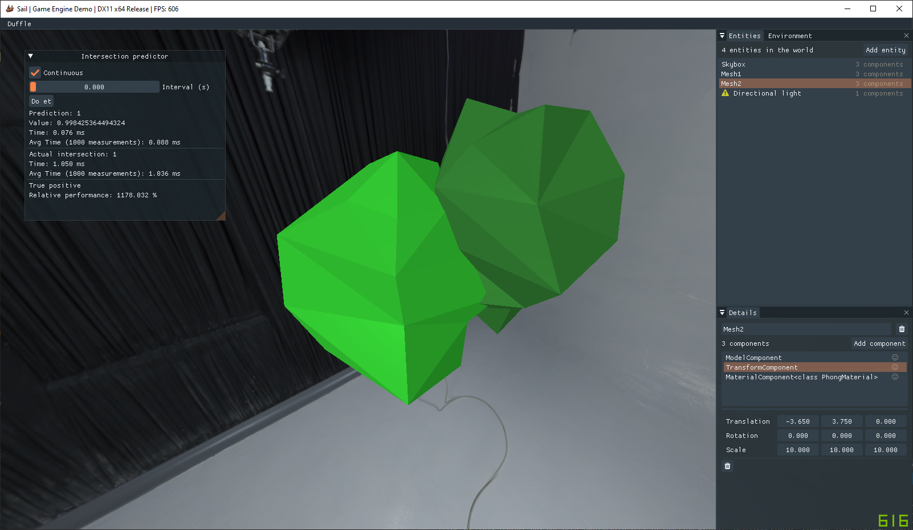

# Visualization tool
### Accompanying the thesis *"A deep neural network approach for intersection testing of two 3D meshes"*  by [Alexander Wester](https://pirat.dev) and [Gustav Björk](https://praccen.github.io/).

This is a tool for importing two meshes and in real-time perform intersection testing between them using both our Deep Neural Network or a default implementation of the Separating Axis Theorem.

A few different mesh-pairs are supplied in an arbitrary format (each x y z coordinate for each vertex is stored in a space-separated txt file, two meshes after each other). It is also possible to import fbx meshes as long as they are triangulated and contain exactly 50 triangles.

## Building

    # Clone the repository 
    git clone https://github.com/Piratkopia13/MasterThesisIntersectionVisualizer.git
    cd MasterThesisIntersectionVisualizer
    # Fetch submodules recursively
    git submodule update --init --recursive 
    # Generate a Visual Studio 2019 solution
    ./generateVS19.bat
The solution should now be ready to start up and compile using either DirectX11 or 12.

##
If you have any questions regarding the thesis or this tool - feel free to contact us at me[at]pirat.dev or gbjorken96[at]hotmail.com 
